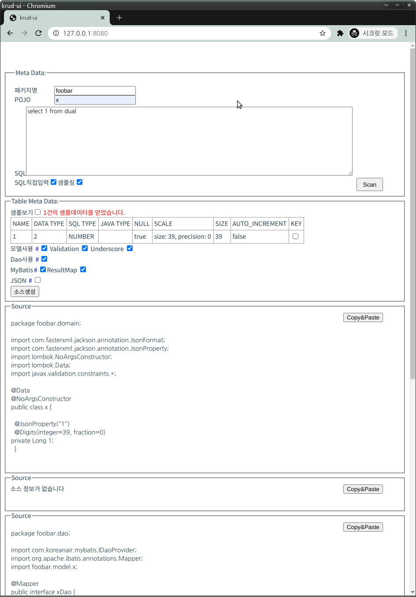

# Build
다음은 도커태크를 생성하지 말고 빌드합니다
```
mvn clean package -DskipDockerTag
```

# Docker Image로 실행하는 방법

데이터베이스 주소가 192.168.11.22 이고 포트가 1339 스키마가 X
사용자 계정이 foobar 비밀번호가 1234일 경우 

```
docker run --name krud  -p 8080:8080 \n 
  -e db.host=192.168.11.22 \n
  -e db.port=1339   \n
  -e db.schema=eshop \n
  -e db.user=foobar \n
  -e db.password=1234 \n
  -e schema=X \n
  -e package=com.koreanair -d krud
```


